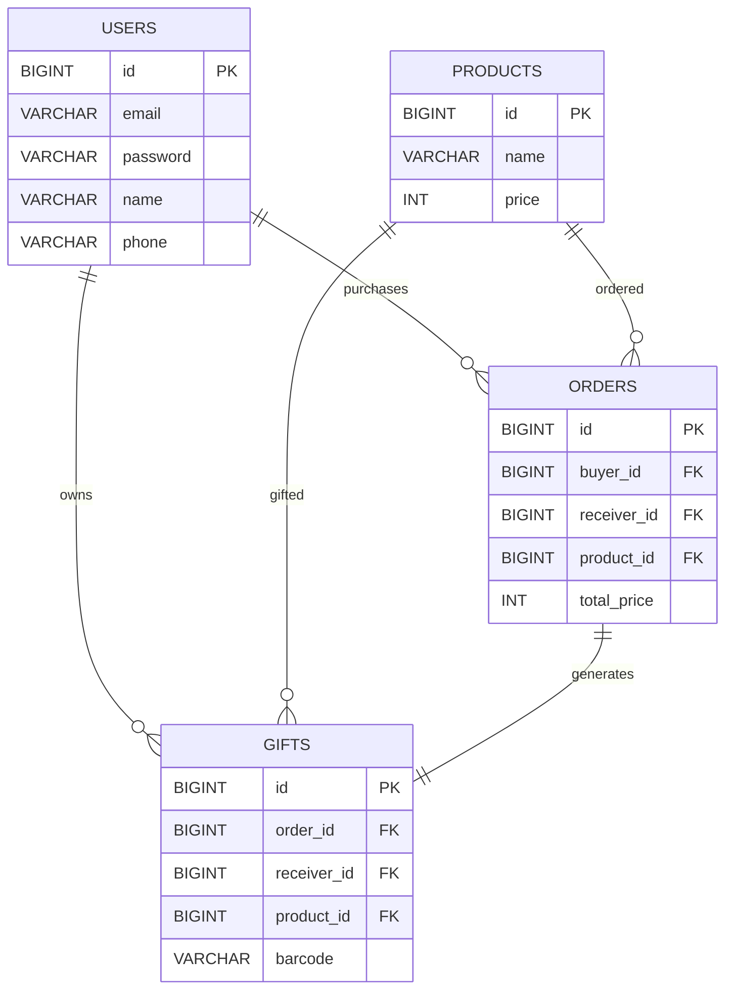

# 📊 데이터베이스 설계서 (ERD)

익산 철도·버스 환승패스 기반 **카카오톡 선물하기 클론 프로젝트**의 데이터베이스 모델과 물리 스키마를 정의한 문서입니다.

본 문서는 프로젝트에서 사용하는 **MySQL 데이터베이스(`kakao_gift`)**의 실제 스키마를 기준으로 작성되었으며, 데이터 모델, 테이블 구조, 관계, 제약조건 및 무결성 보장 전략을 설명합니다.

---

# 📌 1. 설계 목표

본 프로젝트의 데이터베이스는 다음과 같은 목표를 기반으로 설계되었습니다.

- 회원 및 비회원 모두에게 선물 전송 가능
- 주문 정보의 영속성 및 추적성 보장
- 데이터 무결성 유지
- 빠른 조회를 위한 인덱스 최적화
- 주문과 교환권 발급의 트랜잭션 보장

---

# 📌 2. 핵심 설계 원칙

## 2.1 비회원 문자 선물 지원

기존 서비스는 회원 간 선물만 가능했지만, 실제 카카오 선물하기처럼 비회원에게도 선물을 보낼 수 있도록 설계했습니다.

이를 위해

- `orders.receiver_id`
- `gifts.receiver_id`

컬럼은 **NULL 허용(Nullable FK)** 구조를 사용합니다.

### 회원 선물

```text
receiver_id → users.id
```

즉시 선물함과 연결됩니다.

### 비회원 선물

```text
receiver_id = NULL
receiver_phone 저장
```

SMS 또는 카카오 알림톡을 통해 교환권을 전달하며, 이후 동일한 전화번호로 회원가입하면 선물을 자동 연결할 수 있도록 설계했습니다.

---

## 2.2 주문 당시 수신자 정보 Snapshot 보존

회원 정보는 언제든 변경될 수 있습니다.

이를 방지하기 위해 주문 시점의 정보를 별도로 저장합니다.

| 컬럼 | 목적 |
|------|------|
| receiver_name | 주문 당시 수신자 이름 |
| receiver_phone | 주문 당시 수신자 전화번호 |

이를 통해

- 영수증 보존
- 감사(Audit)
- 분쟁 대응
- 데이터 불변성(Immutability)

을 보장합니다.

---

## 2.3 주문과 교환권의 1:1 관계

교환권은 주문 하나당 반드시 하나만 존재해야 합니다.

이를 위해

```text
gifts.order_id
```

에 **UNIQUE 제약조건**을 적용했습니다.

```
Orders 1
        │
        │
        │
        1
      Gifts
```

중복 발급은 DB 레벨에서 차단됩니다.

---

# 📌 3. 테이블 물리 명세

---

## 👤 users

회원 계정 및 인증 정보를 저장하는 테이블입니다.

| 컬럼명 | 타입 | NULL | 제약조건 | 기본값 | 설명 |
|--------|------|------|----------|---------|------|
| id | BIGINT | NO | PK, AUTO_INCREMENT | - | 회원 ID |
| email | VARCHAR(100) | NO | UNIQUE | - | 로그인 이메일 |
| password | VARCHAR(255) | NO | | | bcrypt 암호화 비밀번호 |
| name | VARCHAR(50) | NO | | | 사용자 이름 |
| phone | VARCHAR(20) | NO | | | 휴대전화 |
| birth_date | DATE | YES | | NULL | 생년월일 |
| gender | VARCHAR(10) | YES | | NULL | 성별 |
| created_at | DATETIME | NO | | CURRENT_TIMESTAMP | 생성일 |
| updated_at | DATETIME | NO | | CURRENT_TIMESTAMP | 수정일 |
| deleted_at | DATETIME | YES | | NULL | 탈퇴일 |

---

## 🛍 products

상품 정보를 저장하는 마스터 테이블입니다.

| 컬럼명 | 타입 | NULL | 제약조건 | 기본값 | 설명 |
|--------|------|------|----------|---------|------|
| id | BIGINT | NO | PK | | 상품 ID |
| name | VARCHAR(255) | NO | | | 상품명 |
| price | INT | NO | | | 가격 |
| description | TEXT | YES | | NULL | 상품 설명 |
| thumbnail_url | VARCHAR(255) | NO | | | 썸네일 |
| category | VARCHAR(50) | NO | | | 상품 분류 |
| brand_name | VARCHAR(100) | NO | | | 브랜드 |
| created_at | DATETIME | NO | | CURRENT_TIMESTAMP | 생성일 |
| updated_at | DATETIME | NO | | CURRENT_TIMESTAMP | 수정일 |

---

## 💳 orders

구매 내역과 결제 정보를 저장하는 테이블입니다.

| 컬럼명 | 타입 | NULL | 제약조건 | 기본값 | 설명 |
|--------|------|------|----------|---------|------|
| id | BIGINT | NO | PK | | 주문 ID |
| buyer_id | BIGINT | NO | FK | | 구매자 |
| receiver_id | BIGINT | YES | FK | NULL | 수신자 |
| receiver_phone | VARCHAR(20) | YES | | NULL | Snapshot 전화번호 |
| receiver_name | VARCHAR(50) | YES | | NULL | Snapshot 이름 |
| product_id | BIGINT | NO | FK | | 상품 |
| total_price | INT | NO | | | 결제금액 |
| payment_status | VARCHAR(20) | NO | | paid | 결제상태 |
| gift_message | TEXT | YES | | NULL | 메시지 |
| created_at | DATETIME | NO | | CURRENT_TIMESTAMP | 생성일 |
| updated_at | DATETIME | NO | | CURRENT_TIMESTAMP | 수정일 |

---

## 🎫 gifts

실제 교환권을 저장하는 테이블입니다.

| 컬럼명 | 타입 | NULL | 제약조건 | 기본값 | 설명 |
|--------|------|------|----------|---------|------|
| id | BIGINT | NO | PK | | 교환권 ID |
| order_id | BIGINT | NO | FK, UNIQUE | | 주문 |
| receiver_id | BIGINT | YES | FK | NULL | 수신자 |
| product_id | BIGINT | NO | FK | | 상품 |
| barcode | VARCHAR(50) | NO | UNIQUE | | 바코드 |
| barcode_image_url | VARCHAR(255) | NO | | | QR/Barcode 이미지 |
| status | VARCHAR(20) | NO | | unused | 사용 여부 |
| expired_at | DATETIME | NO | | | 만료일 |
| used_at | DATETIME | YES | | NULL | 사용일 |
| created_at | DATETIME | NO | | CURRENT_TIMESTAMP | 생성일 |
| updated_at | DATETIME | NO | | CURRENT_TIMESTAMP | 수정일 |

---

# 📌 4. ERD(Entity Relationship)

## Mermaid ERD



---

## 관계 구조

```text
+-----------+             +-------------+             +-----------+
|   USERS   |             |  PRODUCTS   |             |   USERS   |
| (Buyer)   |             |             |             |(Receiver) |
+-----+-----+             +------+------+\            +-----+-----+
      |                           |                         |
      | 1                         | 1                       | 0..1
      |                           |                         |
      | N                         | N                       | N
+-----v---------------------------v-------------------------v------+
|                              ORDERS                             |
+------------------------------+----------------------------------+
                               |
                               | 1
                               |
                               | 1 (UNIQUE)
+------------------------------v----------------------------------+
|                               GIFTS                             |
+-----------------------------------------------------------------+
```

---

# 📌 5. 관계 및 제약조건

## users ↔ orders

- 1명의 회원은 여러 주문을 생성할 수 있습니다.
- `buyer_id`는 NOT NULL입니다.

---

## users ↔ gifts

- 회원은 여러 개의 교환권을 보유할 수 있습니다.
- 비회원 선물은 `receiver_id = NULL`입니다.

---

## products ↔ orders

- 하나의 상품은 여러 주문에서 사용됩니다.

---

## products ↔ gifts

- 하나의 상품은 여러 교환권으로 발급될 수 있습니다.

---

## orders ↔ gifts

- 주문 하나당 교환권 하나만 존재합니다.
- `gifts.order_id UNIQUE`로 강제합니다.

---

# 📌 6. 인덱스 전략

## 일반 인덱스(B-Tree)

외래키 컬럼에는 MySQL InnoDB 기본 B-Tree 인덱스를 적용합니다.

- buyer_id
- receiver_id
- product_id

이를 통해

- 주문 조회
- 선물함 조회
- 상품 조회

성능을 향상시킵니다.

---

## UNIQUE 인덱스

### gifts.order_id

주문당 교환권 하나만 생성되도록 보장합니다.

### gifts.barcode

바코드 조회 시 빠른 검색과 중복 방지를 제공합니다.

---

# 📌 7. 트랜잭션 및 데이터 무결성

주문 생성과 교환권 발급은 하나의 데이터베이스 트랜잭션으로 처리합니다.

```text
BEGIN

INSERT INTO orders

↓

INSERT INTO gifts

↓

COMMIT
```

둘 중 하나라도 실패하면

```text
ROLLBACK
```

을 수행하여 데이터 불일치를 방지합니다.

본 프로젝트는 ACID 원칙 중 다음을 보장하도록 설계되었습니다.

- Atomicity (원자성)
- Consistency (일관성)
- Isolation (격리성)
- Durability (지속성)

---

# 📌 8. 요약

본 데이터베이스는 다음과 같은 특징을 갖습니다.

- 비회원 문자 선물 지원
- 주문 Snapshot 저장
- 주문 ↔ 교환권 1:1 관계 보장
- 외래키 기반 참조 무결성 유지
- B-Tree 인덱스를 통한 조회 성능 향상
- UNIQUE 제약조건으로 중복 데이터 방지
- ACID 기반 트랜잭션 처리
- 실제 MySQL 물리 스키마 기준 설계